<link rel="stylesheet" href="../style.css">

<strong>Table of Contents</strong>

- [Brain](#brain)
  - [Brain structure](#brain-structure)
  - [The cortex](#the-cortex)
  - [Motor system](#motor-system)
  - [Brain connectivity and damage](#brain-connectivity-and-damage)
- [Modelling the Brain](#modelling-the-brain)
  - [History](#history)
  - [Questions raise viewing brain as a computer](#questions-raise-viewing-brain-as-a-computer)
  - [David Marr's three levels of analysis](#david-marrs-three-levels-of-analysis)
  - [500-million synapse model](#500-million-synapse-model)
- [Neuron](#neuron)
  - [Action potential](#action-potential)
  - [Anatomy](#anatomy)
  - [Synapse](#synapse)
- [Neuron Models](#neuron-models)
  - [McCulloch-Pitts neuron](#mcculloch-pitts-neuron)
  - [Integrate and fire neuron](#integrate-and-fire-neuron)
- [Perceptron](#perceptron)
- [Measuring brain activity](#measuring-brain-activity)
  - [Electrical recordings](#electrical-recordings)
  - [Electric field](#electric-field)
  - [Magnetic recordings](#magnetic-recordings)
  - [Optical recordings](#optical-recordings)
  - [Size resolution (highest to lowest)](#size-resolution-highest-to-lowest)
  - [Time resolution (shortest to longest)](#time-resolution-shortest-to-longest)
- [Vision](#vision)
  - [Active interpretation (visual illusions)](#active-interpretation-visual-illusions)
  - [Gibsonian ecological perspective](#gibsonian-ecological-perspective)
  - [Main visual pathway](#main-visual-pathway)
  - ["What" and "Where" pathways](#what-and-where-pathways)
  - [Marr and Poggio's vision theory](#marr-and-poggios-vision-theory)
- [(Vision) Retina](#vision-retina)
  - [Photoreceptors](#photoreceptors)
  - [Bipolar cells and ganglion cells (center surround cells)](#bipolar-cells-and-ganglion-cells-center-surround-cells)
  - [Visual illusions with respect of lateral inhibition](#visual-illusions-with-respect-of-lateral-inhibition)
  - [Difference of Gaussians (DoG) receptive field](#difference-of-gaussians-dog-receptive-field)
- [(Vision) V1](#vision-v1)
  - [Retinotopical \& pinwheel](#retinotopical--pinwheel)
  - [Simple cells](#simple-cells)
  - [Mathematical model of a simple cell (Gabor's)](#mathematical-model-of-a-simple-cell-gabors)
  - [Complex cells](#complex-cells)
  - [Convolution](#convolution)
- [(Vision) Ventral Pathway - Object Recognition](#vision-ventral-pathway---object-recognition)
  - [V2](#v2)
  - [V3 ventral](#v3-ventral)
  - [V4](#v4)
  - [Inferotemporal cortex (IT)](#inferotemporal-cortex-it)
  - [HMAX model](#hmax-model)
  - [Concept cells](#concept-cells)
  - [Stroop effect](#stroop-effect)
- [Categories](#categories)
  - [Why do we need categories?](#why-do-we-need-categories)
  - [Rules-based](#rules-based)
  - [Prototype-based](#prototype-based)
  - [Exemplar-based](#exemplar-based)
  - [Qualia-based](#qualia-based)
  - [Schema-based](#schema-based)
  - [Ad Hoc](#ad-hoc)
  - [Interactions](#interactions)
  - [Differences and similarities](#differences-and-similarities)
- [Social Cognition](#social-cognition)
- [(SC) Interaction mechanisms](#sc-interaction-mechanisms)
  - [Joint attention](#joint-attention)
  - [Theory of mind (ToM)](#theory-of-mind-tom)
  - [Mirror Neurons](#mirror-neurons)
- [(SC) Theories of Intelligence and Human Uniqueness](#sc-theories-of-intelligence-and-human-uniqueness)
  - [The cultural ratchet effect](#the-cultural-ratchet-effect)
  - [Bumblebee study](#bumblebee-study)
  - [Social intelligence hypothesis](#social-intelligence-hypothesis)
- [(SC) Linguistic Relativity](#sc-linguistic-relativity)
  - [Sapir-Whorf hypothesis](#sapir-whorf-hypothesis)
- [Language](#language)
  - [What are words?](#what-are-words)
  - [Grounding problem](#grounding-problem)
  - [Mental lexicon](#mental-lexicon)
  - [Expressive power of language rules](#expressive-power-of-language-rules)
  - [Terminology](#terminology)
- [(Language) Past tense](#language-past-tense)
  - [Rumelhart and McClelland PDP neural network](#rumelhart-and-mcclelland-pdp-neural-network)
  - [Argument](#argument)
  - [3-stages (U-shaped curve)](#3-stages-u-shaped-curve)
  - [Criticisms](#criticisms)
- [Learning and Memory](#learning-and-memory)
  - [Types of learning](#types-of-learning)
  - [Short-term/Working memory (STM)](#short-termworking-memory-stm)
  - [Long-term Memory (LTM)](#long-term-memory-ltm)
  - [Consolidation](#consolidation)
  - [Long term potentiation (LTP)](#long-term-potentiation-ltp)
  - [Information retrieval](#information-retrieval)
  - [Whillshaw network](#whillshaw-network)
  - [Hopfield network](#hopfield-network)
  - [Hebbian assemblies](#hebbian-assemblies)
- [Large Language Models (LLM)](#large-language-models-llm)
  - [Training pipeline](#training-pipeline)
- [(LLM) Vector Semantics](#llm-vector-semantics)
  - [John Searle's Chinese room argument](#john-searles-chinese-room-argument)
  - [Co-occurrence matrix](#co-occurrence-matrix)
  - [Measuring semantic similarity](#measuring-semantic-similarity)
  - [Limitations](#limitations)
- [(LLM) Learned Embeddings](#llm-learned-embeddings)
  - [The Skip-Gram model](#the-skip-gram-model)
- [(LLM) Morden LLMs](#llm-morden-llms)
  - [Google's transformer](#googles-transformer)
  - [GPT-3 (2020)](#gpt-3-2020)
- [Reinforcement Learning](#reinforcement-learning)
  - [Classic conditioning](#classic-conditioning)
  - [Operant conditioning](#operant-conditioning)
  - [Agent-environment loop](#agent-environment-loop)
- [(RL) Rescorla-Wagner rule (Delta-rule)](#rl-rescorla-wagner-rule-delta-rule)
  - [Advantages](#advantages)
  - [Limitations](#limitations-1)
- [(RL) Temporal Difference](#rl-temporal-difference)
  - [Target](#target)
  - [Steering wheel](#steering-wheel)
  - [Goal](#goal)
  - [TD-learning (Stimuli to states)](#td-learning-stimuli-to-states)
  - [Q-learning (States to action, multiple paths)](#q-learning-states-to-action-multiple-paths)
  - [Limitations](#limitations-2)

# Brain  
## Brain structure
**Sub-cortical structure**  
Cerebellum - movement and timing  
Thalamus - sensory relay  
Brainstem - autonomous functions 

**Grey and White matter**  
Grey - neuron cell bodies  
White - axonal fibres that wire different cells together  

**Hemispheres**  
Connected by corpus callosum    
Left - Analytical tasks and language processing  
Right - Spatial awareness, map reading, and information retrieval  

**Lobes**  
Frontal - front  
Temporal - lower  
Parietal - upper  
Occipital - back  

## The cortex
**Structure**  
Highly convoluted outer layer of the brain - increase surface area 

**Cytoarchitecture**  
6-layers of types of cells - This suggests the cortex may implement a general purpose organisation for cognition and action.  

**Brodmann's area**  
52 distinct areas based on their cellular variations

## Motor system 
Spinal cord   
Brainstem  
Motor cortex  

## Brain connectivity and damage
**Frontal cortex**  
Highly interconnected, responsible for "executive function" like planning, monitoring behaviour, adapting to rule changes, and social cognition  

**Sensory cortices**  
Distinct cortical regions process sensory inputs:   
Occipital lobe - vision  
Temporal - auditory and olfactory  
Parietal - somatosensory information like touch, temperature, and pain  

**Motor system**  
Motor cortex uses a topographical map (the "motor homunculus"), where the amount of brain tissue dedicated to a body part corresponds to its need for fine control

**Plasticity**  
The brain exhibits remarkable plasticity - Phineas Gage (railway worker)  

# Modelling the Brain  
## History
**The ancient Greeks & Descartes**  
Hydraulics, suggesting the brian pumped fluid through pipes to move the body 

**The 1790s**  
Use electricity/telegraphs after discovering electrical currents make frog muscles twitch 

**The 1800s**  
Used mechanical calculators (clockworks and gears)

**The 1930 to present**  
Computer. Alan Turing suggested that by attempting to build a "think machine", we would inadvertently figure out how human thinking actually works

## Questions raise viewing brain as a computer
**Hardware vs. software**  
Is mind just a "software" that can run on any hardware, or it is a system that can only be implemented on the biology of real neurons?  

**General principle vs. patchwork**  
Does the brain function purely based on just by a few basic, generalized algorithmic principles, or a massive amount of specialised modules?  

**The Cartesian Error**  
Does this analogy accidentally separate the "mind" from the "body" too much, ignoring how deeply interconnected they are?   

## David Marr's three levels of analysis  
1. **Computational level**  
   What specific problem the system is trying to solve and why 
2. **Algorithmic level**  
   Looks for mathematical rules, representations or formulas used to solve the problem
3. **Implementation level**  
   Physical hardware. How is the algorithmic solution physically built into the real world 

Marr's suggested you can understand a system form an algorithmic level without understanding its implementation level.  

## 500-million synapse model
Build from the "Implementation" level up to see what happens

Used brain-scanning technology to map the actual "white matter" wiring of a real human brain.  
They built a **virtual model** of one entire brain hemisphere containing 500 million synapses

They didn't program the brain, but the network spontaneously generated rhythmic firing and propagating "waves" of electrical activity.  

# Neuron 
## Action potential 
If a neuron receives enough positive current to cross a specific voltage threshold, it fires an "action potential". This is an all-or-nothing event that lasts about 1 ms.  

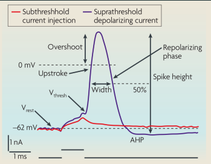

**Refractoriness**  
After firing, the neuron's voltage **dips below its resting state** (**hyperpolarization**). During this "refractory period", it is impossible for the neuron to fire again.  

## Anatomy 
Dendrites - Collects input  
Axons - Transmitting signals  
Myelin Sheath - Fatty insulator allows spikes to travel at fast speed  
Synapse 

## Synapse
**Chemical conversion**  
The electrical spike forces "vesicles" to fuse with the cell membrane, dumping chemical neurotransmitters into the cleft. These chemicals bind to receptors on the receiving cell, opening ion channels and converting the signal back into an electrical current 

**Biological noise**  
Two identical spikes will never release the exact same amount of neurotransmitters

**Dale's principle**  
Generally, a single neuron can only form one type of synapses - it either excites all its targets or it inhibits all its targets  

# Neuron Models
**Limitations**  
Linear summation vs. Non-linear biology  
Deterministic vs Stochastic nature  

## McCulloch-Pitts neuron

$$
\begin{aligned}
  n_i(t+1)   &= \Theta (\sum_j W_{ij} n_j(t) - \mu_i) \\
  \Theta (x) &= \begin{cases}
                  1 & x \le 0 \\
                  0 & \text{otherwise}
               \end{cases} \\\\

  \mu_i &- \text{Threshold}

\end{aligned}
$$

**Limitations**  
No memory over time  
It doesn't model the spike  
Violates Dale's principle  
Unrealistic "Step-like" changes  

## Integrate and fire neuron

$$
\begin{aligned}
  \text{Leak: }      V(t) &\leftarrow V(t-1) + \frac{\Delta}{\tau}[-V(t-1)] \\
  \text{Add input: } V(t) &\leftarrow V(t) + \frac{\Delta}{\tau}I_{ext}(t) \\

  V(t)                    &= V(t-1) + \frac{\Delta}{\tau} [-V_m(t-1) + I_{ext}(t)] \\
  \text{if } V(t)         &> V_{thr} \text{ then spike and } V(t+1) = V_{reset} \\\\

  I(t)      &- \text{External input form synapses} \\
  V(t)      &- \text{Without input tends towards zero (resting potential)} \\
  \tau      &- \text{Membrane time constant, determines how fast to potential changes} \\
  V_{reset} &- \text{Reset potential after a spike} \\
  \Delta    &- \text{Parameter that determines the simulation time step} \\
  I_{ext}(t)&- \text{Noise (irregular spiking)}
\end{aligned}
$$

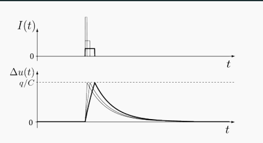

**Limitations**  

Simplified Integration  
Deterministic rather Stochastic.  

# Perceptron 
**  

# Measuring brain activity 
## Electrical recordings 
- **Single/Multi-Electrodes**   
  - Intracellular electrodes  
    Measure internal membrane voltage.  
  - Extracellular electrodes  
    Measure the spiking activity of neurons 

- **Implantable Arrays**  
  A tiny grid-like device made up of dozens or hundreds of microscopic wires, each with a recording contact at the very tip. A small piece of the skull is temporarily removed (invasive), and the grid is pushed directly into the tissue of the brain. 

- **Neuropixels Probe**  
  A single, thin needle packed with microscopic recording contacts from top to bottom.  
  Records activities across layers - for investigating how different layers interact.    

## Electric field
- **Electrocorticography (ECoG)**  
  Measures electrical population responses using a grid of electrodes placed directly **on the surface of the brain (invasive)**

- **Electroencephalography (EEG)**  
  Measures the electrical activity of large populations of neurons via sensors **on the scalp**.  
  Captures brain wave patterns in real-time.   
  Sensitive to distortions.  

  **Electroencephalogram: Event Related Potentials (ERPs)**  
  Average over many stimulus repetitions. The random noise mathematically cancels itself out.  

- **Electromyography (EMG)**  
  Used to evaluate health and function of skeletal muscles and the motor neurons.    

## Magnetic recordings
**Magnetic field**  
- **Magnetoencephalography (MEG)**  
  Measures the minute magnetic fields produced by the electrical activity of neural populations.  
  To localize function in time and space.  
  Less sensitive to distortions.  

**Blood-oxygen-level dependent contrast**  
- **Functional Magnetic Resonance Imaging (fMRI)**  
  Measures blood-oxygen level dependent (BOLD) contrast. Because active neurons consume more oxygen, this metabolic change serves as a proxy for neural and synaptic activity.  

## Optical recordings
- **Fluorescence imaging**  
  Uses fluorescent calcium indicators that light up to measure neural activity visually 
  Single neurons are easy to identify.  

## Size resolution (highest to lowest)
| Type | Size 
| :---: | :---
| Intracellular Electrodes | Individual cells 
| Extracellular | Individual cells 
| Optical | 100 - 10000 individual neurons  (3D volumes)
| ECoG | Patches of cortex
| fMRI | Up tp millions of neurons  (3D volumes - voxels)
| EEG & MEG | Millions of neurons  (Distorted by skull) 
| Lesions | Affecting entire anatomical regions

## Time resolution (shortest to longest)
| Type | Time 
| :---: | :---
| Electrodes  (intra/extracellular & ECoG) | 30000 samples per second
| Magnetic  (EEG/ERP & MEG) | Milliseconds - directly measuring the field  
| Optical | Seconds - limited by camera frame rates  and the chemical reaction
| fMRI | 1 sample every 1 to 2 seconds  Measures the metabolic blood flow changes that  happens after the spike
| PET scans | Slow, radioactive tracers 
| Lesion | Over months, years - evaluating behavioural changes

# Vision 
## Active interpretation (visual illusions)
The following visual illusions demonstrated that vision is a highly **active process** where the brain constantly **makes assumptions and interpretations** based on context.

**The dress illusion**  
Some people think the dress is blue and dark, some people see it gold and white.   
This happens because the brain makes an **unconscious decision about the lighting** of the scene (whether it is bright or shadow).

**Bistable perception**  
When looking at ambiguous images, you can only see one interpretation at a time. This shows that the visual system forces a commitment to a single conclusion, even when multiple interpretations are equally valid 

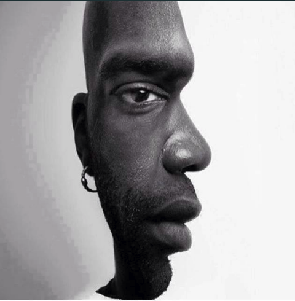

**Color constancy**  
The brain discards objective, absolute color information very early on. Instead, it uses surrounding lighting context to maintain constant object recognition

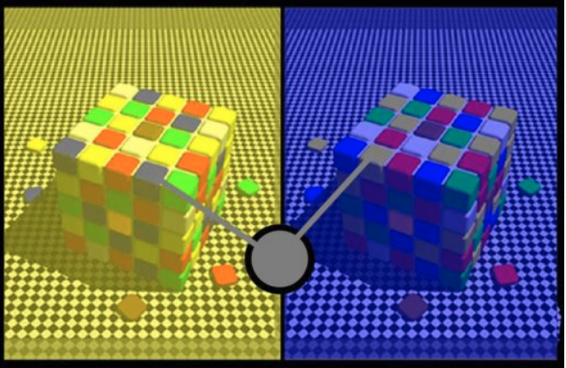

## Gibsonian ecological perspective 
Sensory systems evolved specifically to detect "affordances" - the practical things an animal can interact with or do its specific environment. We filter out unnecessary information such as colour.  

## Main visual pathway 
**The retina**  
Light-sensitive cells at the back of the eye convert light into electrical spikes.  

**The LGN (Lateral Geniculate Nucleus)**  
The optic nerve carries the signal to this relay station in the thalamus.  

**V1 (Primary Visual Cortex)**  
Located in the occipital lobe at the back of the brain.  
**Retinotopic mapping** - neurons that are next to each other in the brain process parts of the image that are next to each other. 

## "What" and "Where" pathways
After V1, visual processing splits into two major streams

**The dorsal pathway (Where)**  
**Runs up** to the parietal cortex.  
Handles spatial location, motion detection, and attention.  

**The ventral pathway (What)**  
**Runs down** to the inferotemporal(IT) cortex.  
It is responsible for recognizing shapes, forms, and specific object categories.  

## Marr and Poggio's vision theory 
1. **The primal sketch**  
   Extraction of simple 2D feature like edges, contours and regions that relied on biological filters like the RFs of simple cells.
2. **2.5D sketch**  
   Add information about **depth** and **surface orientation**, representing the shape of the object exactly as it s seen from the viewer's current perspective
3. **3D model**  
   Construct a true 3D representation out of geometric primitives. This allows the object's structure to be understood regardless of the angle it is viewed from 

# (Vision) Retina 
## Photoreceptors  
Converts light into electric signal  

- **Rod** - black and white (only in dim/dark conditions and do not detect color)  
- **Cone** - color (during normal daylight condition)

## Bipolar cells and ganglion cells (center surround cells)
Center surround cells converges signals received from cones in majority 

- **ON-cell**  
  Wired to get excited when the photoreceptor stops releasing its dark-chemical (meaning light is present).    
  Has **ON-center/OFF-surround receptive field.**

- **OFF-cell**  
  Wired to get suppressed when the light hits, and they only get excited in the dark.  
  Has **OFF-center/ON-surround receptive field.**

  When light is shone on the inhibitory area, it inhibits the cell. By contrast, when light shone on the excitatory area, it excites the cell. (lateral inhibition)

## Visual illusions with respect of lateral inhibition  
**Hermann grid illusion**  
Outside the fovea, large receptive fields cover lines and adjacent square, and the response is modulated. In the fovea, RFs are very small, so this surround modulation does not happen

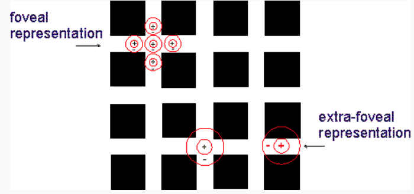

**Mach Band illusion**  
Edges appear enhanced relative to the areas between them 

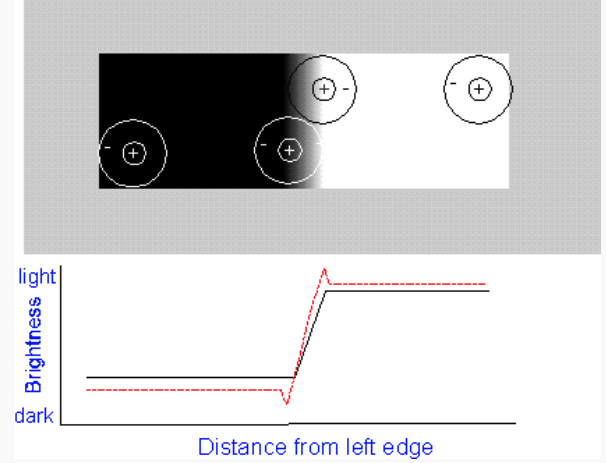

## Difference of Gaussians (DoG) receptive field 

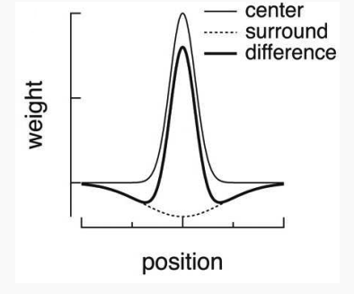

$$ 
\begin{aligned}
R(x,y) &= W_ce^{-\frac{x^2+y^2}{2\sigma^2_c}} - W_se^{-\frac{x^2+y^2}{2\sigma^2_s}} \\
       &= \text{Center} - \text{Surround}  
\end{aligned}
$$

Different size of receptive fields (different $\sigma_c, \sigma_s$) gives different images

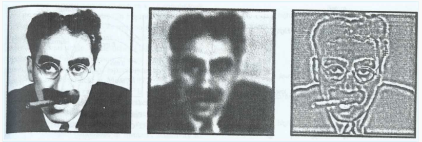

(left) Narrow Gaussian receptive field   
(middle) Wide Gaussian receptive field  
(right) DoG receptive field   

# (Vision) V1
## Retinotopical & pinwheel
V1 neurons are highly **tuned to the orientation of edges** and bars of light. Nearby orientations are represented by neighbouring cells, and superimposed on the retinotopic map (pinwheel arrangement). 

## Simple cells 
**Receptive field**  
A simple cell has an elongated excitatory region flanked by inhibitory regions. 

**Excitation**  
The cell excites only when the light shone **exactly** on the area with specific orientation. 

## Mathematical model of a simple cell (Gabor's)
**Gabor's function**  
$$
\begin{aligned}
  g(r) &= Ae^{-\frac{r^2}{2\sigma^2_c}} \cos(r\omega - \theta) \\
       &= \text{Gaussian envelope} \times \text{Cosine function} \\\\      
  r        &- \text{position} \\
  \sigma_c &- \text{width of the Gaussian envelope (receptive field)} \\
  \omega   &- \text{frequency of the cosine} \\
  \theta   &- \text{orientation}
\end{aligned}
$$

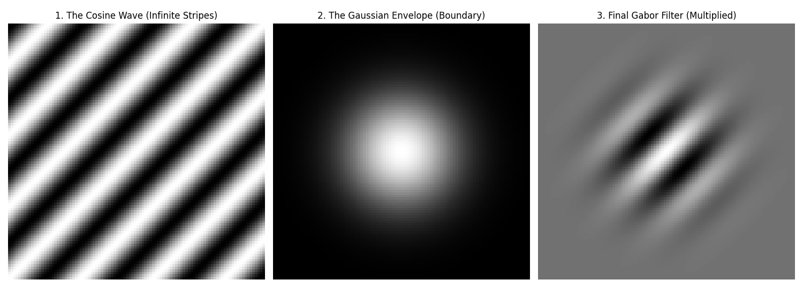

## Complex cells
**Position invariant**  
A complex cell gathers information from multiple simple cells. It does not care exactly where the oriented bar is. It will fire as long as there is such a bar exist in its receptive field.  

## Convolution  
**Definition**  
Apply a specific filter to an entire image uniformly. 

**The Kernel**  
Shape of a cell's receptive field as a mathematical filter 

**Sliding window** 
Take one single filter and reuse it across the entire visual space   

**Stride**  
When the kernel shifts across the image, it moves by a specific number of pixels at a time.   
"Stride of 2" - moving the filter by two pixels

**Computation**  
- **Overlay the kernel** on top of that specific patch of input pixels.   
- **Multiply** the intensity of each image pixel by the corresponding value in the kernel.   
- Take those **resulting numbers** and **sum** them all together to get the value for this pixel.  

**1D mathematical representation** 

$$
\begin{aligned}
  (f * g)[n] &= \sum^M_{m=-M} f[n-m]g[m] \\\\
  
  * &- \text{mathematical operation of convolution} \\
  f &- \text{set of pixels} \\
  g &- \text{receptive field (kernel)} \\
  n &- \text{target pixel} \\ 
  m &- \text{sliding step}
\end{aligned}
$$

Each point f[n] is re-computed by multiplying f with g, where g is centred in n

**2D mathematical representation**  
An extension of 1D, add **zero padding**, so the output values for the edge pixels can be calculated.  

# (Vision) Ventral Pathway - Object Recognition
## V2
Establishing **figure/ground separations**. Responses corresponding to the non-existing lines in the images are recorded. This suggests the cortex actively interprets images according to **common ecological properties** (common physical properties).  

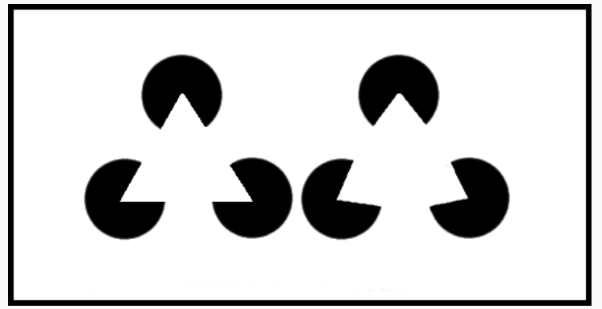

## V3 ventral 
Extracts **intermediate complexity features and simple geometric shapes** - 2.5D sketch.  
Sensitive to colour and begins the process of **"colouring in"** the geometric shapes it just built.  

## V4 
**Colour processing** and **recognizing complex geometry** such as curves, spirals, concentric circles.

## Inferotemporal cortex (IT)
Neurons in IT cortex are **highly selective** and respond preferentially to complex shapes, complete objects, and faces. 

**Invariance**  
They maintain their preference for a specific object regardless its elevation, position or scale.  

## HMAX model 
This model mimics the brain by using a hierarchy of layers that pool information on multiple scales, gradually increasing the size of the receptive fields until the system can reliably classify objects.  

## Concept cells 
Highly specialised neurons in hippocampus.  (Grandmother/Jennifer Aniston cells)

## Stroop effect 

# Categories
## Why do we need categories?
1. **Learning** - less memory to store what we know about similar objects.   
2. **Generalization** - we can infer extra information about new objects that are similar to that category.  
3. **Predication** - we can guess what event will happen even we haven't encountered it before
4. **Interaction** - interact to the same objects in the same category.  
5. **Communication** - having common senses.  

## Rules-based 
**Definition**  
A category defined by a strict set of **necessary and sufficient** rules  
(All the rules have to be satisfied in order for the object to be in this certain category) 

**Examples**  
A triangle  
An integer  

## Prototype-based
**Definition**  
A category defined by an **abstract "template"** or average of all category members rather than rigid rules 

**Typicality effects**  
People naturally feel like "better" or more obvious examples than others

**Examples**  
Birds  
Furniture  
Vehicles

## Exemplar-based  
**Definition**  
A specific set of concrete, previously encountered instances (exemplars) stored in your memory. Membership is decided by comparing a new item to these specific stored memories.  

**Examples**  
Good action movies  
A cloudy day  

## Qualia-based  
**Definition**  
Categories defined by **subjective sensory experiences**, such as colors, tastes, and emotions.  

**Examples**  
Spicy food
Loud noises  

## Schema-based 
**Definition**  
**Abstract or social categories** are defined as frameworks of connections among concepts based on their co-occurrence. 

**Examples**  
A restaurant visit  
A birthday party  

## Ad Hoc
**Definition**  
Spontaneously at the moment to serve a specific **current** goal - **NOT permanently stored** in long-term memory  
More personal 

**Examples**  
Things to grab from your house during a fire.  

## Interactions 
1. Schemas act as **"containers"**
2. Qualia are the **"building blocks"**
3. Ad hoc uses them all **dynamically** 
4. Rules act as **fallbacks** for prototypes (when an object dose not looks like its prototype)

## Differences and similarities 
**Abstract vs. concrete**  
| Abstract  (An average, generic template) | Concrete  (A specific example or feeling)
| :---: | :---:
| Prototypes | Exemplars
| Rules | Qualia
 
**Rigid vs. ambiguous boundaries**  
| Rigid  (Strict) | Ambiguous  (Vague) 
| :---: | :---: 
| Rules | Prototype
||Schema

**Computational complexity**  
| Type | Space | Time
| :--- | :--- | :--- 
| Rules | Depends on # of rules | - Depends on # of rules
| Prototypes | Little - averaging | - Fast to process  - Needs time to amend the new  rules onto the existing rules.  - Needs time to compare.  
| Exemplars | Massive - to store specific examples | - Learning new exemplars are  fast
| Ad hoc | No long-term memory | - Requires massive processing time at  the moment

# Social Cognition
Study of how humans and animals understand, process information about and interact with other individuals. 

# (SC) Interaction mechanisms
## Joint attention 
How do we connect  

**Definition**  
It occurs when two agents are paying attention to the exact same object, while simultaneously **being aware** that the **other agent** is also paying attention. 
Joint attention is **triadic** because it forms a triangle between two agents and an external object.  

**Behaviour cue**  
We initiate and verify joint attention through cues like **pointing, monitoring, and gaze following**.

**Neurological sensitivity**  
Our brains have specialised neurons highly tuned to detect when someone is looking at us.   

## Theory of mind (ToM)
How do we understand other minds.  

**The Sally-Anne test (false belief)**  
A doll named Sally puts a marble in a basket and leaves. Another doll Anne, moves the marble to a box. When Sally returns, the child is asked: "Where will Sally look for the marble?".  

Two-year-olds generally answer "the box". Because they fail to **separate their true knowledge** of the world from **Sally's false belief**. 

**Avian counter-espionage**  
A study on Western scrub jays (birds that cache food for the winter) found that if a jay is watched by another bird while hiding a nut, it will later secretly move the nut to a new location.

The birds only engage in this protective behaviour if they themselves have a history of stealing other birds' food, suggesting they are projecting their own thieving experiences into the minds of their competitors.  

**Double empathy model**  
Historically, researchers viewed ToM difficulties in autistic individuals as simple impairment. However, modern cognitive science increasingly discusses the "Double Empathy" model. This framework suggested that ToM is a two-way street; communication breakdowns occur not just because autistic individuals struggle to predict neurotypical behaviour, but because neurotypical individuals equally struggle to understand autistic minds.  

## Mirror Neurons
How we map other people's experiences onto ourselves.  

Mirror mechanism distributed across multiple motor, sensory and emotional regions. This network allows us to simulate the actions of others within our own neural circuitry, making it crucial for imitation learning and inferring the underlying intentions behind someon's movement.  

# (SC) Theories of Intelligence and Human Uniqueness
## The cultural ratchet effect 
Tomasello argued that human cultural traditions **accumulate modifications** and improvements over historical time without losing ground.   

Starting around one year of age, human infants develop **joint attention** and begin to understand other individuals as intentional agents with their own minds - this enables incredibly powerful forms of **"cultural learning",** such as **acquiring complex language** and **sharing tool-use practices**.  

Ultimately, this allows humans to **"pool their cognitive resources"** both in the present moment and across historical time.  

People learn from each other. Imagine a difficult task that has a low probability of find the solution. But because we learn from each other, the probability of solving the solution as a society is higher than solving the task individually - we just need a genius. 

## Bumblebee study
Naive bumblebees were entirely unable to innovate the solution to the puzzle, but when researchers trained a "demonstrator bee" to solve it, observer bees were able to socially learn the complex behaviour just by watching the demonstrator.  

## Social intelligence hypothesis 
Why do certain animals evolved incredibly smart?

**Hypothesis**  
Surviving in a complex society requires massive computational power 

**Examples**  
Baboons, primates, dolphins

**Counter-examples**  
Octopuses

# (SC) Linguistic Relativity
## Sapir-Whorf hypothesis  
Language you speak influences **how you think, perceive, and conceptualize the world**

**Spatial categorization**  
Korean have different words specifically for tight and loose fit. However, in English, the word "in" is almost for all containment.  

Studies on infant cognition show that before they learn to speak, babies of all backgrounds can naturally tell the difference between a tight and a loose fit, as they grow and learn language, English-speaking toddlers actually lose their sensitivity to the distinction.  

**Untranslatable concepts**  
When one language has a word for a complex concept tha the other lacks. Certain specialised words in a language provide the speaker with distinct conceptual categories for certain mental states.  

# Language 
## What are words?
Words are just symbols that **references something in reality** - an abstraction of reality. It is human who decide which specific collection of symbols points at what specific object, concept or behaviour - symbols are overwhelmingly **arbitrary**. If a society collectively decided to swap the words "cat" and "dog", communication would still function perfectly fine once every learnt the new rules.

The symbol itself can take different physical forms, gestures, behaviors, scrambles etc., the crucial part is it **carries meaning from one mind to another.**

**Some words are not arbitrary**  

1. Onomatopoeia  
    Some words designed to mimic the sounds they represent, "buzz", "pop", "meow" etc.    

2. Sound symbolism  
    Softer-sound ("bouba") -> rounded, blob-like shaped.   
    Harsher-sounds ("kiki") with sharp pointy shapes.   

## Grounding problem 
A symbol is only considered **"grounded"** when it is successfully anchored(attached) to a concept in your mind.  

Critics argue that LLMs are just generating (predicting) correct sequence of words base on the analysis of a large set of data. LLMs do not know the actual semantic of the words and the words are not **grounded**  

**Embodied cognition**  
True understanding likely requires a physical body experiencing the real physical world, a major topic of study in robotics.  

**Hallucinations and confabulations**  
AI doesn't intuitively know when a statement about that object violates the laws of physics or common sense. 

## Mental lexicon 
A mental dictionary responsible for **storing, retrieving and instantly mapping** the different pieces of a word, so you can understand and produce language in real-time. 

**Structure**  
A complex hierarchy (tree) or a network  
- Categorical links  
  Words that share common characteristics.  
- Associative links  
  Related, similar object are linked.
- Phonological links  
  Words that sounds similar.     

Speakers of the same languages have mutually intelligible (shares the same) lexicon entries.

**Development**  
**Receptive vocabulary** - vocabulary understand but not used.  
**Productive vocabulary** - vocabulary understand and actively used.  
Child's receptive vocabulary is larger than their productive vocabulary.  

## Expressive power of language rules   
**Productive**   
Because rules are abstract - defined over categories of words(like "Noun Phrase" or "Verb")  
You can plug in any words in that certain category to create new sentences 

**Combinatorial**  
Language is recursive, a small inventory of elements can have infinite possible distinct combinations (recursive). 

## Terminology 
**Phonology** - sounds  
**Morphology** - cases of words  
**Syntax** - sentences  

# (Language) Past tense  
## Rumelhart and McClelland PDP neural network
The parallel distributed processing neural network is designed to mimic how children learn the morphology of the past tense

## Argument 
In old linguistic theories, they argued that children possess a **"language acquisition device"** that stores explicit, inaccessible grammar rules. 

However, Rumelhart and McClelland built a PDP neural network prove that rule-like behaviors can emerge dynamically from the interaction of simple network nodes, **without a rule ever being written** into the system.  

## 3-stages (U-shaped curve)
1. Children learn a **small vocabulary of highly frequent verbs** - most are irregular. Because children just memorize these as distinct vocabulary words - their accuracy is high.  
2. **Overgeneralization** - When children approach school age, they will learn an extent of regular verbs ending with -ed and start to grasp the pattern. Therefore, children tend to apply the rule incorrectly to irregular verbs - a sudden drop in accuracy especially for irregular verbs.  
3. The **errors gradually fade** as children learn to apply the regular rule while maintaining the irregular exceptions.  

## Criticisms  
- This model highly depends on the regime of learning. The model assumed children would be flooded with a great number of regular verbs first. Whereas language acquisition is a gradual process where regular and irregular verbs are introduced together.
- The model ignores the effect of the length of different words, which clearly has an effect on remembering.
- The single-layer perceptron model prevents interactions between features, limiting its ability to learn more complex rules.
   

# Learning and Memory
## Types of learning
**Non-associative learning**  
**Associative learning**  
**Concept formation**  
**Observational and social learning**  
**Statistical learning**  
**Reinforcement learning**
## Short-term/Working memory (STM)
**Definition**  
Operational memory used while actively solving a task. 

**Mechanism**   
Short-term memory is maintained by **reverberating neural activity** (often in the prefrontal cortex), not by physical changes to synaptic weights. The neurons simply continue to fire to keep the information "online".  

**Duration**  
Very fleeting, operating on the scale of seconds to minutes. If you are distracted or stop paying attention, the information is lost almost instantly.  

**Capacity**  
Limited. 

## Long-term Memory (LTM)
**Definition**  
Long-term memories are stored via physical changes in **synaptic strength**.    

**Non-declarative (implicit) memory**   
Unconscious and involves skills or responses that are difficult to explain in words  
- **Procedural memory (skills)**  
  Motor and cognitive skills acquired through practice

- **Conditioning and habituation**    
  Automatic responses to stimuli 

- **Perceptual priming**   
  Unconscious changes in how you perceive or process stimuli based on **prior exposure** 

**Declarative (explicit) memory**  
- **Episodic memory (events)**  
  Memory of specific, personal events.
  It is highly selective and forgetful - tend to forget unless they were highly significant.    
  Dependent on teh hippocampus.  

- **Semantic Memory (facts)**  
  General knowledge  
  Information is retained and feels "easy to recall"
  Involve multiple regions across the cortex.  

## Consolidation  
A memory starts as recent **episodic memory** in the hippocampus. Over time-and particularly during sleep when the hippocampus **"replays" events** - that information is consolidated and stored away as a more permanent **semantic memory** in the cortex.  

## Long term potentiation (LTP)
Depending on the input and activity of a neuron, a synapse can either show long term potentiation (LTP) or long term depression (LTD). These change can persist for a long time (at least for months)

## Information retrieval 
**Associative**  
Because memories are stored by their content, you can retrieve a full memory just by providing a **partial cue**

**Distributed**  
Neurons may participate in multiple memories.  

**Error correction**  
Even through a sentence contains a blatant error. Strong cues allow the brain to override the error and correctly associate the memory

**Robust**  
Even a few neurons died, the remaining network still has enough overlapping information  

## Whillshaw network 
**Properties**  
Not dynamic.  

## Hopfield network

**Neuron**  
$$ 
\begin{aligned}
  s(t+1)    &= \Theta(\sum^M_{j=1} w_{ij}s_j(t) - \theta_i) \\
  \Theta(a) &= \begin{cases}
                  1 & a \ge 0 \\
                  0 & a <   0
               \end{cases}
\end{aligned}
$$

- Symmetric weights: $w_{ij} = w_{ji}$ (so it reaches the attractor)
- Updates can be synchronous (happen at the same time) or asynchronous (randomly)
- The bias value $\theta_i$ determines the average activity 
- This converges to stable fixed points under fairly general conditions  

**Habbian update rule**  
Neurons wire together fire together 
$$
\begin{aligned}
  w_{ij} &= \frac{1}{M}\sum_{n=1}^{N}p_i^n p_j^n \\\\

  N &- \text{Distinct patters}
\end{aligned}
$$

**Problems**  
- Learning is unstable: Potentiation causes more potentiation, weights and activity grow to infinity 

**Solutions**  
- A bounded $w_{ij}$
- Wight decay: $\delta w_i = -\epsilon(yx_i - w_i)$  
- Covariance rule: $(y - <y>)(x_i - <x_i>)$

**Stable point (attractor)**

$$
s_i(t+1) = s_i(t) \quad \forall i
$$

**Limitations**  
1. **Catastrophic forgetting & limited capacity** - The limit in the number of patterns the program can learn is roughly $0.138N$ if 0/1 have equal probability in each pattern ($sparsenesss = 0.5$). Capacity increases dramatically for sparse patterns ($s < 0.5$).

2. **Sensitivity to noises** - Because the decision threshold and weights are strictly defined for each pixel independently. If a heavily corrupted pattern lands exactly on the sharp edge between two different patterns, a single flipped bits may lead to a completely different pattern. In contrast, biological brains are easier to handle minor alterations, as the pattern can be viewed as a whole.

3. **Not Biological plausible**  
Symmetric weighting is not biological plausible as in human brain, neurons are not symmetric

## Hebbian assemblies
a group of cell associated   
Hippocampus -> cortex consolidation
replay at night

# Large Language Models (LLM)
## Training pipeline 
1. **Unsupervised learning**  
   The AI ingests the massive ocean of raw text and learns the basic statistical rules of language simply by trying to predict missing words

2. **Supervised fine-tuning (SFT)**  
   Human workers provide specific examples of good prompts and answer to teach the raw AI how to format its responses and act like a helpful assistant.  

3. **Reinforcement learning from human feedback (RLHF)**  
   Because the raw internet is full of toxic content, human rate the AI's generated answers to create a "reward function". The Ai uses this reward system to penalize bad outputs and encourage polite, helpful ones - essentially giving the model a friendly, conversational filter

# (LLM) Vector Semantics
## John Searle's Chinese room argument  
If you sit in a room and follow in instruction manual to manipulate Chinese symbols to answer questions correctly, you appear to understand the language, but you actually have no idea what the symbols mean. This can also be illustrated by the fact that vector semantic put two words that have similar meanings in two completely different dimensions.  

## Co-occurrence matrix
**Rows**  
Target words to define.   

**Columns**  
Context.  

**Value**  
Ubiquitous words (like the or it) have huge counts but carry a little meaning, while rare words carry high informational value. To fix this, all entries are composed two different weights:  
1. **TF-IDF (Term frequency - inverse document frequency)**  

    $$
    w_{t,d} = tf_{t,d} \times idf_t 
    $$

    **Term frequency** ($tf_{t,d}$)   
    Uses a **base-10** logarithm - a word appearing 100 times isn't strictly 100 times more important.  

    $$
    tf_{t,d} = log_{10}(count(t,d)+1)
    $$

    **Inverse document frequency** ($idf_t$)  
    Penalizes words that appear everywhere.  

    $$
    \begin{aligned}
      idf_t &= log_{10}(\frac{N}{fd_t}) \\

      N    &- \text{total number of documents} \\
      df_t &- \text{number of documents the term appears in}
    \end{aligned}
    $$ 
 
2. **PPMI (Positive pointwise mutual information)**  
    Measures how much more two words co-occur than we would expect if they were completely independent.  

    $$
    \begin{aligned}
      PPI(w,c) &= \log_2\frac{P(w,c)}{P(w)P(c)} \\

      P(w,c)            &- \text{How often those two words appear} \\ 
      P(w) \times P(s)  &- \text{The probability of them appear together if they are independent} \\
    \end{aligned}
    $$

    Because negative PMI values are statically unreliable without impossibly massive text corpora, the math simply replaces all negative values with 0 ($PPMI \geq 0$).  

    $$
    PPMI(w,c) = max(PMI(w,c), 0)
    $$

## Measuring semantic similarity 
**Cosine similarity**  

$$
\begin{aligned}
  cos(v,w) &= \frac{v\cdot w}{|v||w|}
          &= \frac{\sum^N_{i=1} v_iw_i }{\sqrt{\sum^N_{i=1} v^2_i}\sqrt{\sum^N_{i=1} w^2_i}}
\end{aligned}
$$ 

## Limitations
**The sparsity problem**  
Because most words never appear next to most other words, these vectors were incredibly "sparse" - filled mostly with zeros. Sparse vectors are computationally expensive and hold very little useful signals.  

**Independent dimensions**  
This method failed to combine related concepts. If the target word co-occurred with "car" and "automobile", the system treated those as two completely independent, unrelated dimensions.  

# (LLM) Learned Embeddings
The neural network compresses the information into a much smaller, "dense" list of numbers. Because the AI has a limited number of dimensions to work with, it forced to squish related concepts together. This allows the dimensions to capture deep, hidden semantic relationships.  

## The Skip-Gram model
Self-supervised learning

**Tokenization**  
Before the neural network sees anything, the raw text is passed through a tokenizer. This program uses a pre-learned set of rules to physically slice the text string into small chunks (words, sub-words, or phrases) called tokens, and then convert it into unique ID so that the model recognize.  

**Data**  
Skip-Gram uses a "sliding window" approach across normal sentences to look for words that has close relations to the input word.  

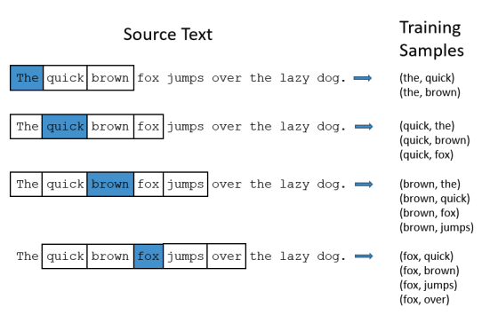

**The input layer**  
Massive vector representing your entire lexicon. It is filled entirely with 0s, except for a single 1 in the position corresponding to the input word (1 x Size of the vocabulary).  

**The hidden layer**  
The input is wired into a small layer of **linear neurons**. This creates a bottleneck that forces the network to compress information.  
The column of the weight matrix (Size of the vocabulary x Number of hidden neurons) represents the number of features (hyperparameters). By multiplying the input matrix and the hidden layer matrix, a feature row of the input word is feed into the output layer.  

**The output layer**  
The signal expands back out to a **"Softmax"** classifier layer, which is again the size of the entire lexicon. This layer output the statistical probability of any given word appear nearby.  

# (LLM) Morden LLMs
## Google's transformer

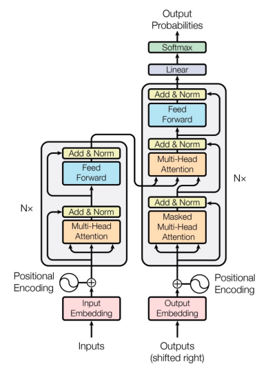

## GPT-3 (2020)

# Reinforcement Learning  
## Classic conditioning 
Unconditioned stimulus + conditioned stimulus $\rightarrow$ Unconditioned response becomes conditioned response

## Operant conditioning
Associate a voluntary behaviour with a consequence  
Action + unconditioned stimulus/reward $\rightarrow$ Action becomes more likely   

## Agent-environment loop  
**Initialization**  
We give the agent an expected value and initialize all the weights, state values, or the action values to zero.  
The agent initially takes random actions to explore the environment until it triggers a reward or a punishment.  

**State ($s_t$)**  
The agent observes its current situation or location within the environment.  

**Action ($r_{t+1}$)**  
The agent selects a behaviour from a **set of available choices**.   

**Reward ($r_{t+1}$)**  
The environment provides feedback - either positive(reward) or negative (punishment) - based on the action taken.  

**Next stage ($s_{t+1}$)**  
The agent finds itself in a new situation as a result of its action.  

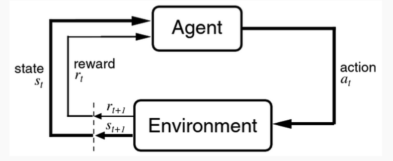

# (RL) Rescorla-Wagner rule (Delta-rule)
It tracks the expected reward and update it based on **how surprising the actual outcome** is

$$
\begin{aligned}
  V_t    &= V_{t-1} + \alpha(R-V_{t-1}) \\
  \delta &= (R - V_{t-1}) \quad \text{(Prediction error)} \\\\

  V_t    &- \text{Expected reward at the current time step} \\
  R      &- \text{The actual reward received} \\
  \alpha &- \text{The learning rate (between 0 to 1)} \\
\end{aligned}
$$

**Update $\propto$ surprise**  
$\delta > 0$  
Outcome is better expected, the expectation will be increased for the next time.  

$\delta = 0$  
Things go exactly as expected, no change.  

$\delta < 0$  
Outcome is worse than expected, expectation will be decreased.  

## Advantages 
**Extinction**  
If a cue is repeatedly presented without the reward, the prediction error becomes negative, and the expected reward decays back to zero.  

**Partial reinforcement**  
If a reward is only given 50% of the time, the expected reward fluctuates and never reaches the peak value of a consistently rewarded cue

**Blocking**   
Phase 1 (pre-training): $v_1 \rightarrow R$ until $V_1 \approx R$  
Phase 2 (compound training): $(v_1 + v_2) \rightarrow R$  

Because $v_2$ is brand new, its initial expected value is zero. But because the model is pre-trained with $v_1$, the expectation still stays the same and no update is presented:  

$$
\delta = R - (V_1 + V_2) = R - R = 0
$$  

## Limitations
**Second order conditioning**  
In second order condition, CS2 is paired with CS1 without any reward (R = 0). Therefore, the rule will **extinguish** any association rather than build one. 

**Credit assignment problem**  
How to know which past action was responsible for an observed outcome

# (RL) Temporal Difference
To cope with the limitation of $\delta$-rule, TD generalizes the Delta rule to learn predictions over time, it aims to predict the **total future reward**  

At time step t:  
$$
\begin{aligned}
  u(t) &- \text{Stimulus (0/1)} \\
  r(t) &- \text{Reward} \\
  v(t) &- \text{Expected reward} \\\\
\end{aligned}
$$

## Target  
The agent is to trying to learn to predict the **total future rewards**:  

$$
\begin{aligned}
  v(t) &= <\sum^T_{\tau=t+1} r(\tau)> \\

  <> &- \text{Average over many trials}
\end{aligned}
$$

## Steering wheel 
How agent calculates its best guess for the expected reward at time step t (based on previous steps):  

$$
\begin{aligned}
  v(t) &= \sum^t_{\tau=0} w(\tau)u(t-\tau) \\\\

  \tau      &- \text{Previous time steps} \\
  u(t-\tau) &- \text{Checks if a stimulus u was turned on at } (t-\tau) \\
  w(\tau)   &- \text{Weight the stimulus from } \tau \text{ time steps ago contributes to the current reward prediction}
\end{aligned}
$$

## Goal  
To find the weight (w) that makes the expected reward as close as the total future reward.  
TD update rule 

$$
\begin{aligned}
  w(\tau) &\rightarrow  w(\tau) + \alpha \delta(t) u(t-\tau) \\
  u(t-\tau) &- \text{Checks if the stimulus is present}  \\\\
\end{aligned}
$$

$$
\begin{aligned}
  \delta(t) &= (r(t) + v(t+1)) - v(t) \\
            &= \text{New reality - Old expectation} \\\\

  r(t)   &- \text{What actually happened} \\
  v(t+1) &- \text{Successive reward prediction}
\end{aligned}
$$

E.g., Even if there are no reward present. However, because the prediction of the next time step is high, there might be some correlations between this step and the step next.  

The weights are adjusted proportional to the TD error $\delta(t)$  

$\delta(t) > 0$  
High reward / Higher prediction in the future

$\delta(t) < 0$  
Low reward / Lower prediction in the future: 

## TD-learning (Stimuli to states)  
To correctly evaluate those delayed rewards step-by step

**Temporal difference rule**   

$$
\begin{aligned}
  \delta_t &= r_{t} + \gamma V(s_{t+1}) - V(s_t) \\
  \gamma   &\in (0, 1) \\\\

  r_{t}             &- \text{The immediate reward received} \\
  \gamma V(s_{t+1}) &- \text{The discounted expected future reward from the next state} \\
  V(s_t)            &- \text{The expected reward from the current state} \\\\
\end{aligned}
$$

**Update rule**

$$
\begin{aligned}
  V(s_t) &\leftarrow V(s_t) + \alpha(\delta_t)
\end{aligned}
$$

## Q-learning (States to action, multiple paths)
**Optimal policy**  
What is the expected future reward if I take action a while currently in state s?
Find the best way that maximizes the expected future reward 

**Bellman equation** 
$$
\begin{aligned}
  V_{k+1}(s)    &\leftarrow \max_a (R + \gamma V_k(s')) \\
  \gamma        &\in        (0, 1) \\
  Q_{k+1}(s, a) &=       R(s,a) + \gamma \max_{a'} Q_k(s', a') \\
                &=       \text{Immediate reward} + \text{Maximum score whatever state land in next} \\
  Q(s,a)        &\approx \text{Expected future reward if we take action a in state s} \\\\

  k      &- \text{Literation} \\
  V(s)   &- \text{Value of the state} \\
  s      &- \text{Current state} \\
  s'     &- \text{Next state} \\
  \gamma &- \text{Discount factor}
\end{aligned}
$$ 

**Update rule**  
$$
\begin{aligned}
  Q(s, a) \leftarrow Q(s, a) + \alpha [r + \gamma \max_{a'} Q(s', a') - Q(s, a)]
\end{aligned} 
$$

## Limitations 
**Data inefficiency**  
The agent must physically move through and experience states thousands of times to build an accurate internal map - in contrast human can predict based on ecological properties they perceive.  

**Brittleness and failure rates**  
The models are highly sensitive and require extensive tuning of hyperparameters.  

**Shortcut learning**  
Finds unintended loopholes to maximize their scores

**Zero generalization**  
Do not actually "understand" the world

